# ClinAgenda

[](https://dotnet.microsoft.com/)
[](https://vuejs.org/)
[](https://www.mysql.com/)
[](LICENSE)

A full-stack application for scheduling medical appointments: doctors and their specialties, patients, appointments and the status each one carries.

Built during the **DEVPIRA + PECEGE 2025** bootcamp. It is my first project in C# and in Vue, and the reason the backend keeps its SQL in plain sight: the repositories use **Dapper**, so every query is written by hand instead of being generated by an ORM.

## Architecture

<p align="center"><a href="docs/architecture.svg"></a></p>

### Backend

Four layers, each one depending only on the one below it:

- **`WebAPI/Controllers`** — the HTTP surface: five controllers, one per resource.
- **`Application/UseCases`** — the operations of each resource, and the DTOs the API speaks.
- **`Core`** — the entities and the repository **interfaces**, so the layers above never name a database.
- **`Infrastructure/Repositories`** — the implementations, with **Dapper** and SQL written by hand.

**MySQL 8** and **Flyway** run in Docker Compose: `V1` creates the schema, `V2` the six tables, `V3` the foreign keys. **Swagger** documents the API, and the connection string is assembled at startup from `DB_USER` and `DB_PASSWORD`.

### Frontend

**Vue 3** with **Vuetify**, **Pinia** and **TypeScript**, built with Vite. It has a dashboard and a list and a form for each resource, an `httpClient` on top of axios, and two shared components: a date picker and a toast.

## Domain

| Entity | What it holds |
|---|---|
| `status` | The name of a state, reused by doctors, patients and appointments |
| `specialty` | A specialty and the length of its appointments (`scheduleDuration`) |
| `doctor` | Name, status, and its specialties through `doctor_specialty` |
| `patient` | Name, phone, document, birth date and status |
| `appointment` | Patient, doctor, specialty, date and an observation |

## API

Every resource follows the same five routes, under `/api/{resource}`, where the resource is `status`, `specialty`, `doctor`, `patient` or `appointment`:

| Method | Path | Description |
|---|---|---|
| `GET` | `/list` | Paginated list; `?name=` filters by part of the name on doctors and patients |
| `GET` | `/listById/{id}` | One record, or **404** |
| `POST` | `/insert` | Creates it |
| `PUT` | `/update/{id}` | Updates it |
| `DELETE` | `/delete/{id}` | Deletes it, unless something still references it |

`/api/patient/autocomplete?name=` is the exception: it returns the matching patients without pagination, for the search field.

```bash
curl -X POST http://localhost:5252/api/doctor/insert \
  -H "Content-Type: application/json" \
  -d '{ "name": "Dra. Ana", "statusId": 1, "specialty": [1] }'
```

With the API running, Swagger is at `http://localhost:5252/swagger`.

## Running locally

Requirements: **.NET 8 SDK**, **Docker** and **Node.js**.

### 1. Database

```bash
cd clinagenda-backend
cp .env.example .env        # fill in DB_USER, DB_PASSWORD and DB_ROOT_PASSWORD
docker compose up -d
```

Compose starts MySQL on port 3306 and runs Flyway, which applies the three migrations and exits.

### 2. API

```bash
dotnet run
```

It listens on `http://localhost:5252` and reads `DB_USER` and `DB_PASSWORD` from the same `.env`.

### 3. Frontend

```bash
cd ../clinagenda-frontend
yarn
yarn dev
```

It opens on `http://localhost:3000`, the origin the API allows in `appsettings.json`. The API address comes from `VITE_BASE_HOST`, in `.env.development`.

## Diagrams

Click a diagram to open it at full size. The diagram is generated from the Mermaid source in `docs/`, so it stays editable text rather than a binary image:

```bash
for d in docs/*.mmd; do
  npx @mermaid-js/mermaid-cli -i "$d" -o "${d%.mmd}.svg" -t default -b white -c docs/mermaid-config.json
  python3 docs/finish-svg.py "${d%.mmd}.svg"
done
```

`finish-svg.py` adds a margin around each diagram and gives the arrow labels an opaque background, so the SVG looks the same in any viewer.

## License

Licensed under the [MIT License](LICENSE).

## Contact

Nathan Paiva de Lacerda — [LinkedIn](https://www.linkedin.com/in/nathan-paiva-636336236)
